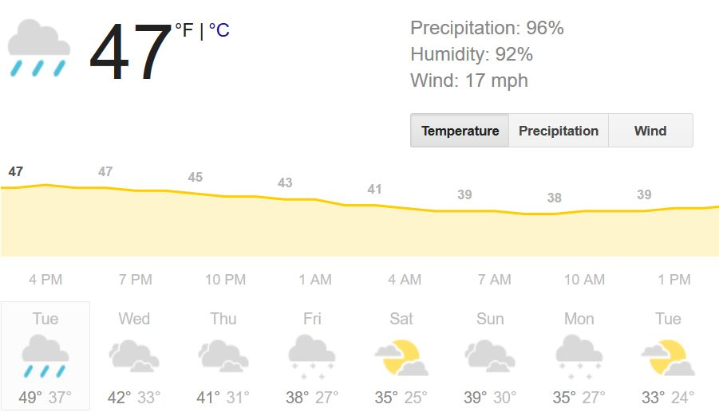

```{r setup, include=FALSE}
options(htmltools.dir.version = FALSE)
library(tidyverse); library(feather); library(plotly);library(DT)
# Load needs mapping table (created by "prep/sis_mappings.R" script)
needs <- read.csv("data/needs.csv") 
# Load de-identified data
scrub_sis <- read_feather("data/scrub_sis.feather")
```
class: inverse, right, bottom
background-image: url("images/maps.jpg")
background-position: top left
background-size: 100% 70%

## Informed Choices
#### Using Assessment Data in Person-Centered Planning
On: 2018.11.14 | Follow along: [bit.ly/sis_pcp](http://bit.ly/sis_pcp)

---
class: inverse, right, bottom 
background-image: url("images/audience.jpg")
background-position: top left
background-size: 100% 70%

## Your trusty guides:
- Laura Demeuse | .small[*MDHHS*]
- Joshua Hagedorn | .small[*TBD Solutions*]

???
Before we get started, let’s get settled.

We’re talking about how to supplement a specific portion of the PCP process, but this doesn’t replace the basics!

### Quick Self-Test:
- Are you looking into the person’s eyes?
- Is your body facing the person or a screen?

We want to be understood. When a person tells us how they see us, we want to recognize ourselves.  Perhaps even more than we want to be seen as positive, we want to be seen for who we are.

An assessment is a mirror that we hold up to let someone see themselves. If they cannot find their reflection, they will distrust the mirror. 

---
class: inverse, right, middle 
background-image: url("images/convo.jpg")
background-position: left
background-size: 50% 100%

.pull-right[
## Why bother?
]

???

### Notes

- *Why use assessment data?*: Don't reinvent the wheel. Use a common language about areas of need can serve as a platform.  Information from the assessment can provide consistent language for discussing goals and needs as part of person-centered planning.
- *Why not just talk?*: The purpose of using information *is* to kickstart a meaningful and comprehensive conversation.  We need to acknowledge from the outset that an assessment will always be a simplified reflection, like a Picasso portrait or a blocky video game.
- *What’s the point?*: Use information to spark reflection. Observations from data can be an opportunity for self-discovery. It is not the final word, but a starting point for reflection. *Example*: Myers-Briggs, StrengthsFinder, etc.

---
class: right, middle

.pull-left[
```{r, echo=FALSE, message=FALSE, warning=FALSE}
read_feather("data/sc_uses.feather") %>%
  plot_ly(
    x = ~short_desc, 
    y = ~pct, 
    color = ~freq,
    hoverinfo = 'text',
    text = ~paste(n, " out of ", responders," supports coordinators (",pct,"%)<br>",
                  "said they ", tolower(freq), " used assessment data to<br>",
                  tolower(long_desc))
  ) %>% 
  add_bars(colors = c("#83AF9B","#C8C8A9","#FC9D9A","#FE4365")) %>% 
  layout(
    margin = list(b = 50),
    barmode = 'stack',
    xaxis = list(title = ""),
    yaxis = list(title = "% indicating current use", range = c(0, 100))
  )
```
]

## Uses

???

### Notes

*Supports coordinators indicated that they used information from the assessment during the PCP process*

According to a [white paper](https://j-hagedorn.github.io/sis_user_survey/survey_analysis.html#use_in_person-centered_planning) approved by the SIS Steering Committee and based on surveys and focus groups across the states, assessment data might be used in the following ways to support person-centered planning:

- Recommend individual support needs to inform an individualized plan of service (IPOS)
- Identify potential goals and objectives for inclusion in the IPOS
- Identify potential referrals for additional assessments or relevant services
- Help guide safety planning by identifying areas of risk
- Design an individualized menu of services to support an individual to live independently in the community
- Identify individual strengths for inclusion in the IPOS
- Provide guidance regarding supports which may provide alternatives to guardianship
- Identify areas of specific personal interest or areas on which the individual wishes to focus

---
class: right, middle 
background-image: url("images/pencils.jpg")
background-position: 0% 0%
background-size: cover

# Let's try it out

???

### Notes:

- *Step 1*:  Split room in half.  Then, split each half into groups of 7-10.  These sections correspond to ‘Snap Judgment’ and ‘Data Only’
- *Step 2*:  Select one person from each group to go through a pre-plan process.  'Data Only' groups get a page, 'Snap Judgment' groups get a person.
- *Step 3*:  Hand out sheets.  Mark on each sheet: 
- *Step 4*:  Reflection.  

For each group, ask: 
- "What was missing?"
- "What did you tend to focus on in developing?"
- "How close was this to a rushed PCP pre-plan?""

---
class: center, middle 

# Sample Report

.pull-left[.small[
```{r, echo=FALSE, message=FALSE, warning=FALSE}
needs_sections <- 
  needs %>% 
  group_by(section,section_desc) %>% 
  summarize() %>%
  ungroup() %>%
  mutate(
    section = str_replace(section,"Q",""),
    section = str_replace(section,"3A","3")
  )

selected_id <- "10761181"

sample_1 <-
scrub_sis %>%
  filter(fake_id == selected_id) %>%
  group_by(fake_id) %>%
  filter(sis_date == max(sis_date)) %>%
  select(fake_id,starts_with("scr_")) %>%
  gather(section,score,everything(),-fake_id) %>%
  filter(!is.na(score)) %>% 
  mutate(section = str_replace(section,"scr_","")) %>%
  separate(section, into = c("section","score_type"),sep = "_") %>%
  left_join(needs_sections, by = "section") %>%
  ungroup()

sample_1 %>%
  filter(is.na(section_desc)==F) %>%
  spread(score_type,score) %>%
  select(section,section_desc,raw,std,pct) %>%
  filter(str_detect(section,"^2")) %>%
  select(-section) %>%
  DT::datatable(
    rownames = F,
    caption = "Support Needs Ratings",
    colnames = c('Subscale', 'Total Raw Score', 'Std Score', '%ile'),
    options = list(dom = 't')
  )
```
]]

.pull-right[
```{r, echo=FALSE, message=FALSE, warning=FALSE, fig.width = 6}
sample_1 %>%
  filter(score_type %in% c("pct","percentile")) %>%
  mutate(
    section_desc = case_when(
      section == "sni" ~ "Support Index %ile",
      TRUE ~ as.character(section_desc)
    )
  ) %>%
  select(section_desc,score) %>%
  plot_ly(x = ~section_desc, y = ~score) %>%
  add_lines() %>%
  add_markers(color = I("#6a5acd")) %>%
  layout(
    title = "Activity Subscale and Composite Score Profile",
    showlegend = FALSE,
    xaxis = list(
      title = "Life Activity Subscale"
    ),
    yaxis = list(
      title = "Percentile",
      range = c(0, 100)
    ),
    margin = list(l = 50, r = 70,b = 120,t = 100,pad = 4)
  )
```

]

???

### Notes:

- Note that the items here are summarized by section, and thus don't get down to the most specific level of detail.  Discuss how to work with this during planning session.
- Note that neither presenter is a trained SIS assessor or QI lead, and thus not specially trained in item intent.  Since Supports Coordinators are also not likely to be trained as such, this allows us to speak to a more general utlitity of the assessment output.

---
class: center, middle 

# Sample Report *(cont'd)*

.pull-left[.small[
```{r, echo=FALSE, message=FALSE, warning=FALSE}
scrub_sis %>%
  filter(fake_id == selected_id) %>%
  group_by(fake_id) %>%
  filter(sis_date == max(sis_date)) %>%
  select(fake_id,starts_with("Q3")) %>%
  select(-ends_with("_ImportantTo"),-ends_with("_ImportantFor")) %>%
  gather(section,score,everything(),-fake_id) %>%
  filter(!is.na(score)) %>% 
  separate(section, into = c("section","score_type"),sep = "_") %>%
  mutate(section = paste0(section,"_")) %>%
  group_by(section) %>%
  summarize(score = sum(score)) %>%
  left_join(needs, by = c("section" = "item")) %>%
  select(item_desc,score)%>%
  arrange(desc(score)) %>%
  DT::datatable(
    rownames = F,
    caption = "Protection and Advocacy Scale",
    colnames = c('Activities in Rank Order', 'Raw Score'),
    options = list(dom = 't')
  )
```

]]

.pull-right[.small[
```{r, echo=FALSE, message=FALSE, warning=FALSE}
scrub_sis %>%
  filter(fake_id == selected_id) %>%
  group_by(fake_id) %>%
  filter(sis_date == max(sis_date)) %>%
  select(fake_id,starts_with("Q1")) %>%
  select(-ends_with("_ImportantTo"),-ends_with("_ImportantFor")) %>%
  gather(section,score,everything(),-fake_id) %>%
  filter(!is.na(score)) %>% 
  separate(section, into = c("section","score_type"),sep = "_") %>%
  mutate(section = str_sub(section,1,3)) %>%
  mutate(is_two = score >= 2) %>%
  group_by(section) %>%
  summarize(
    score = sum(score),
    has_2 = sum(is_two)
  ) %>%
  left_join(needs %>% distinct(section, .keep_all = T), by = "section") %>%
  select(section_desc,score,has_2) %>%
  mutate(
    over_5 = ifelse(score > 5,"Yes","No"),
    has_2  = ifelse(has_2 == T,"Yes","No")
  ) %>%
  arrange(desc(score)) %>%
  DT::datatable(
    rownames = F,
    caption = "Exceptional Medical / Behavioral Support Needs",
    colnames = c('Activity', 'Total Points','*Total Points > 5','*Any Item Circled 2'),
    options = list(dom = 't')
  )
```

]]

---
class: right, middle 
background-image: url("images/rain.jpg")
background-position: right
background-size: 50%

.pull-left[
```{r, echo=FALSE, out.width = "100%",fig.align='center'}

```
]

## Act natural

???

### Notes:
- Conversational data...
- Can you think of a way to have a natural conversation using the data shown here?
- What questions might you ask the person?
- How might you use assessment data similarly?

---
class: inverse, left, middle 

# Framing a Conversation

.pull-left[
- ### Take a Broad View
- ### Say No to COPY|PASTE
- ### Provide Clear Choices
]

.pull-right[
Research indicates that:
- We are influenced by our starting point (Sunstein, 2008)
- Simplifying options increases participation ([Iyengar, 2010](https://www0.gsb.columbia.edu/mygsb/faculty/research/pubfiles/4519/simplicitySeeking.pdf))
- Providing categories to choose from increases satisfaction with choice ([Mogilner, 2008](https://pdfs.semanticscholar.org/706b/84d3567ba03939c3748c94dae36a74a5a64f.pdf)).
]

???
### Notes:

*Take the broad view*:

- Because what you start with influences what you get.
- If an assessment is broad enough to cover multiple areas of a person’s life, it can set the stage for a person-centered planning process which encompasses all areas of a person’s life.

*Say No to COPY|PASTE*:

- Defaults and the temptation to copy/paste (Sunstein, 2008).  
- Would you rather have the default scope for the PCP discussion be all life areas, or the ones addressed last year?

*Provide Clear Choices*:
- Because trying to juggle too many balls needs us to drop them all
- Simplify without over-simplifying: an art
- Informed by, not determined by!  Use in pre-planning allows the person to decide what gets addressed during their PCP Meeting.

---
class: left, middle

## Where Do Your Goals Fit?

*I want to improve my...*   | *So I need some support with...*
--------------------------- | -------------------------------- 
**Emotional Wellbeing**         | Behavioral Supports, Health and **Safety**
**Relationships** | Social Activities, Community Living
**Material Wellbeing**         | Employment
**Personal Development**       | Health and Safety, Lifelong Learning
**Physical Wellbeing**         | Health and Safety, Home Living, Lifelong Learning, Medical Supports
**Rights**                      | Protection and Advocacy
**Self Determination**          | Lifelong Learning, Protection and Advocacy, Social Activities
**Social Inclusion**           | Community Living, Lifelong Learning, Protection and Advocacy

.small[*Based on van Loon, J., et al. Assessing Individual Support Needs to Enhance Personal Outcomes.*]

???

### Notes:

Ask audience for examples of things they would like to improve in their lives.  

---
class: left, middle 
background-image: url("images/stop.jpg")
background-position: left
background-size: 50% 100%

.pull-right[
## Please do *not*...
- Just copy/paste from the assessment
- Treat a [person-as-a-data-point](https://www.nytimes.com/2011/02/27/opinion/27verghese.html)
- Use 'because the assessment said' as the reason for a goal
]

???

### Notes:

*Person-as-a-data-point*: If it was as easy to transform a person’s life as it is to change a data point, then we’d all have much easier jobs!
*Because the assessment said*: ~~“Per the SIS John needs the most support in Self Care therefore he will have 23 hours of CLS a week”~~

---
class: inverse, left, middle

## Official Guidance

.pull-left[
### Related to parity
“…this approach will not establish or serve as the authorization for the supports and services of an individual and will be used to inform the person-centered planning process which is driven by the individual.”

*Wieferich, J. (2018, October 1). Parity (Letter to PIHP and CMHSP Executive Directors).*
]

.pull-right[
### Also, do NOT use...
- "As an arbitrary methodology for determining the amount, scope, and duration… outside of a person-centered planning process."
- "As a means for achieving budget reductions."
- "As a process which supplants use of medical necessity criteria..."

*Renwick, T. (2015, October 22). Inappropriate Use of Assessments and Screening Tools (Letter to PIHP Executive Directors).*
]

---
class: center, middle 
background-image: url("images/balloon_chair.jpg")
background-position: left
background-size: 50% 100%

.pull-right[
# Demo
]

???

### Notes:

Review the assessment before meeting with the person.

Explain the process and where the information comes from.

For each need that is identified as important, ask about:
- *Maintain or Aspire?*  Is there a discrepancy between the person's current situation and what they want?
- *Goals/Targets*  What concrete goals do we want to meet and by when?
- *Supportive environment?*  What situations and people are most important to lead to success?
- *Supports* What sources of support are available?  How might these best fit into the person's life?
- *Next Steps* What steps will be taken to meet the stated Goals/Targets?
- *Sequence* What is the order in which the person wants to address these issues?  Is there anything that has to be done first in order to accomplish this?

---
class: left, top

# A sketch

```{r, echo=FALSE, message=FALSE, warning=FALSE, fig.align='left'}

library(sunburstR)

sunburst_df <- read_feather("data/sunburst_df.feather")

personal_items <- unique(unlist(strsplit(sunburst_df$path[sunburst_df$domain == "Personal"], '-')))
interpersonal_items <- unique(unlist(strsplit(sunburst_df$path[sunburst_df$domain == "Interpersonal"], '-')))
environment_items <- unique(unlist(strsplit(sunburst_df$path[sunburst_df$domain == "Environment"], '-')))
legend_items <- c(personal_items,interpersonal_items,environment_items)


cols <- 
  c(
    colorRampPalette(RColorBrewer::brewer.pal(9, 'Blues'))(length(personal_items)),
    colorRampPalette(RColorBrewer::brewer.pal(9, 'Oranges'))(length(interpersonal_items)),
    colorRampPalette(RColorBrewer::brewer.pal(9, 'Greens'))(length(environment_items))
  )

sunburst_df %>%
  ungroup() %>%
  select(path,score) %>%
  arrange(score) %>% 
  sunburst(
    colors = list(
      range=cols,
      domain=legend_items
    ),
    width="100%",
    height=300
  )

```

???

### Notes:

- Think of this like a layered pie chart, with each layer going outward breaking down the interior layers into subcategories.
- In each concentric ring, within each color, a darker hue corresponds to a greater need
- We could further refine this to emphasize items that the person or their family had incated as important.

---
class: center, middle
background-image: url(http://www.tbdsolutions.com/wp-content/themes/tbdsolutions/images/logo.png)

---
class: left, middle
background-image: url("images/paper.jpg")
background-color: transparent
background-position: 0% 0%
background-size: cover

## If you like reading…

.small[
- Bambara, L. M., & Gomez, O. N. (2001). Using a self-instructional training package to teach complex problem-solving skills to adults with moderate and severe disabilities. *Education and Training in Mental Retardation and Developmental Disabilities*, 386-400.
- Croft, B., İsvan, N., Parish, S. L., & Mahoney, K. J. (2018). Housing and Employment Outcomes for Mental Health Self-Direction Participants. *Psychiatric Services*.
- Fowler, C. H., Konrad, M., Walker, A. R., Test, D. W., & Wood, W. M. (2007). Self-determination interventions' effects on the academic performance of students with developmental disabilities. *Education and Training in Developmental Disabilities*, 270-285.
- Iyengar, S. S., & Lepper, M. R. (2002). Choice and its consequences: On the costs and benefits of self-determination. In A. Tesser, D. A. Stapel, & J. V. Wood (Eds.), *Self and motivation: Emerging psychological perspectives* (pp. 71-96). Washington, DC, US: American Psychological Association. 
- Iyengar, S. S., & Kamenica, E. (2010). Choice proliferation, simplicity seeking, and asset allocation. *Journal of Public Economics*, 94(7-8), 530-539.
- Mogilner, C., Rudnick, T., & Iyengar, S. S. (2008). The mere categorization effect: How the presence of categories increases choosers' perceptions of assortment variety and outcome satisfaction. *Journal of Consumer Research*, 35(2), 202-215.
- Sunstein, C. & Thaler, R.H. (2008). *Nudge: Improving decisions about health, wealth, and happiness*.
- Wehmeyer, M. L., Palmer, S. B., Shogren, K., Williams-Diehm, K., & Soukup, J. H. (2013). Establishing a causal relationship between intervention to promote self-determination and enhanced student self-determination. *The Journal of Special Education*, 46(4), 195-210.
]
